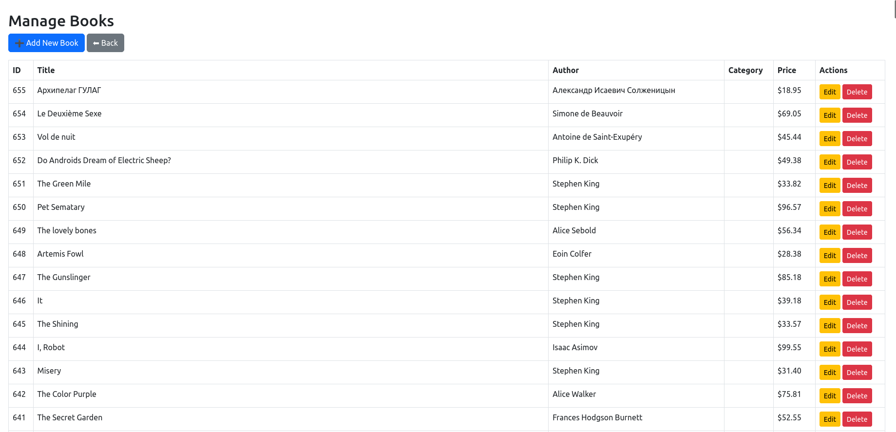

# 📚 Online Library Management System ( BookVerse )

An Online Library Management System built with **PHP, MySQL, Bootstrap, and HTML/CSS**.  
This project helps manage books, students, and borrowing records in a digital library.  

---
developed by : 
1- Abanoub Yousry Shaker
2- Mustafa Hamdi Mohammed 
---

## 🚀 Project Description
The website is divided into two modules:
- **Admin Module**
- **Student Module**

---

## 🛠️ Admin Module Features
- **Admin Dashboard**
  - View **Borrowed Books**, **All Books**, and **All Users**.
  - Add, Update, and Delete books.
  - Search for a student using their **Student ID**.
  - View student details.
  - Update their own profile.
  - Authorization is applied so **only admin** can perform these tasks.

---

## 👨‍🎓 Student Module Features
- Students can **register** to the website.
- Students can **view all books** and their details.
- Students can **borrow a book**.
- After login, students have their own **Dashboard** where they can:
  - View borrowed books.
  - Return books back to the shelf.
  - Update their own profile.
  - View borrowed books with **return date & time**.

---

## 🏗️ Tech Stack
- **Frontend:** HTML, CSS, Bootstrap  
- **Backend:** PHP  
- **Database:** MySQL  

---

## 🏗️ Notes
Some of the project pages are unused and are just incomplete secondary pages.
like : mangeUser.php,updateProfile.php,deleteUser.php
---

## 📸 Screenshots

### 🔹 User Dashboard

### 🔹 Admin Dashboard

